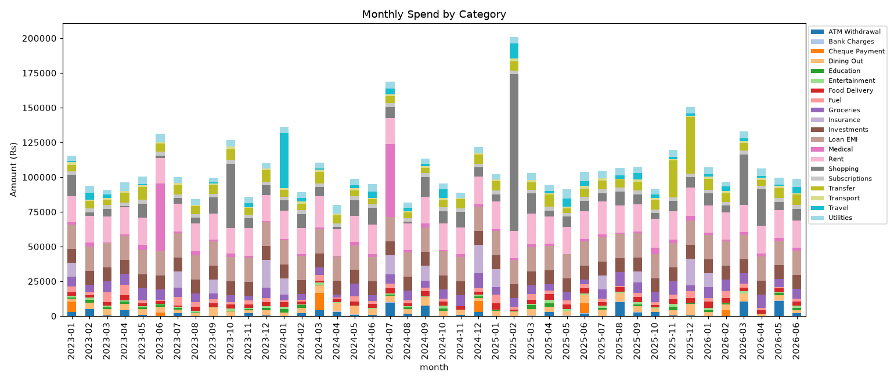
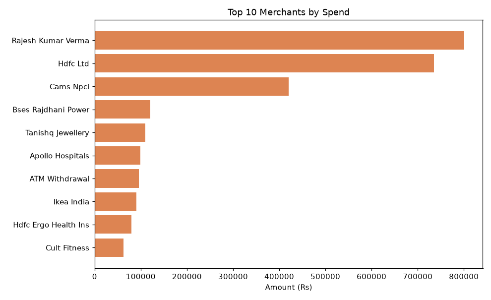

# Personal Finance Analyzer

> A Python CLI + Jupyter analysis that ingests a raw bank/UPI transaction CSV,
> categorizes every transaction with keyword rules, computes monthly spend by
> category, flags statistical outliers, and exports a multi-page PDF report.

**About this project.** I'm a Flutter developer transitioning into AI/ML
engineering, and I'm building in public — one real, end-to-end project at a
time. This is the first. Beyond being a genuinely useful tool, it's where I
picked up Pandas, clean Python module structure, and the notebook-to-script
workflow. I've written this README to double as a walkthrough, so anyone
making the same mobile-dev → data/ML jump can follow the reasoning, not just
the code. Feedback and questions are very welcome.

Hand it a CSV, run one command, get a report:

```bash
python finance.py --input data/bank_transactions_dummy.csv --report
```

---

## Table of contents

1. [What it does](#1-what-it-does)
2. [Quickstart](#2-quickstart)
3. [Project structure — and why it's shaped this way](#3-project-structure--and-why-its-shaped-this-way)
4. [The data pipeline, module by module](#4-the-data-pipeline-module-by-module)
5. [Flutter/Dart → Python: the mental-model map](#5-flutterdart--python-the-mental-model-map)
6. [Pandas concepts you'll use forever](#6-pandas-concepts-youll-use-forever)
7. [Design decisions & trade-offs](#7-design-decisions--trade-offs)
8. [The dirty-data gotchas (and how each was handled)](#8-the-dirty-data-gotchas-and-how-each-was-handled)
9. [How to *think* about a project like this](#9-how-to-think-about-a-project-like-this)
10. [Stretch goals](#10-stretch-goals)
11. [Screenshots](#11-screenshots)

---

## 1. What it does

Given a bank statement export (the messy, real-world kind — no clean
"category" column, amounts split across two columns, dates as strings), the
tool:

- **Cleans** it into one tidy table with a single signed `amount` column.
- **Categorizes** each transaction (`SWIGGY → Food Delivery`, `UBER → Transport`, …) using ordered keyword rules.
- **Aggregates**: monthly spend per category, top-10 merchants, headline stats (income, spend, savings rate).
- **Flags outliers**: transactions more than 2 standard deviations above their *own category's* mean.
- **Reports**: prints a summary to the terminal and (with `--report`) writes a multi-page PDF with charts.

There are two front doors to the exact same logic:

- **`analyze.ipynb`** — the *lab*. Explore, plot, sanity-check the rules interactively.
- **`finance.py`** — the *product*. One command, reproducible output, shareable PDF.

That split — notebook to explore, script to ship — is, in my view, the single
most important workflow habit for this kind of data work. More on it in §3 and §9.

---

## 2. Quickstart

**Prerequisites:** [uv](https://docs.astral.sh/uv/) and Python 3.11.

```bash
# 1. install dependencies into a local .venv (uv reads pyproject.toml)
uv sync

# 2. (optional) regenerate the synthetic dataset
uv run python generate_bank_data.py

# 3. run the analysis + build the PDF
uv run python finance.py --input data/bank_transactions_dummy.csv --report

# 4. explore interactively
uv run jupyter lab analyze.ipynb   # or open analyze.ipynb in Cursor
```

CLI options:

| Flag | Meaning |
|------|---------|
| `--input PATH` | **(required)** path to the transaction CSV |
| `--report` | also write a PDF report |
| `--output PATH` | PDF path (default: `<input>_report.pdf`) |
| `--top-n N` | how many top merchants to show (default 10) |

> **Note on `uv run`:** always prefix Python commands with `uv run`. It
> guarantees the code executes inside this project's `.venv` with the exact
> pinned dependencies — the Python equivalent of running against your
> `pubspec.lock` instead of whatever's globally installed.

---

## 3. Project structure — and why it's shaped this way

```
FinanceAnalyzer/
├── finance.py              # CLI entry point  (the "product")
├── analyze.ipynb           # exploratory notebook  (the "lab")
├── generate_bank_data.py   # makes the synthetic CSV
├── analyzer/               # the actual reusable package
│   ├── __init__.py
│   ├── utils.py            # load + CLEAN the CSV  →  tidy DataFrame
│   ├── categorize.py       # narration text  →  category + merchant
│   ├── statistics.py       # aggregations: monthly / top-N / outliers
│   └── report.py           # tidy DataFrame  →  multi-page PDF
├── data/                   # input CSVs (committed) + output PDFs (gitignored)
├── assets/                 # chart PNGs for this README
└── pyproject.toml          # dependencies + project metadata
```

**Why a package (`analyzer/`) instead of one big `finance.py`?**

Coming from Flutter, think of `analyzer/` as your `lib/` folder — small
files, one clear responsibility each, imported where needed. The golden
rule this structure enforces: **the notebook and the CLI import the *same*
functions.** There is exactly one implementation of "categorize a
transaction," and both front doors call it. If you fix a categorization
rule, the notebook and the PDF both get the fix for free. Duplicated logic
is where bugs breed.

The pipeline is a clean one-directional flow, and each module is one arrow:

```
raw CSV ──utils.load_transactions──▶ tidy DataFrame
        ──categorize.add_categories─▶ + category, merchant columns
        ──statistics.*──────────────▶ aggregates & outliers
        ──report.generate_pdf───────▶ report.pdf
```

Each stage only knows about the shape of the data handed to it — the same
way a well-layered app has a data layer that doesn't care about the UI.

---

## 4. The data pipeline, module by module

### `analyzer/utils.py` — load and clean

This is the **only** place that touches raw, messy input. Everything
downstream gets to assume a clean, predictable table. That boundary is
deliberate: isolate the mess in one file so the rest of the code stays
simple.

Key moves:

- **Rename columns** from the bank's export headers (`"Withdrawal Amt."`)
  to code-friendly names (`withdrawal`). You never want `df["Chq./Ref.No."]`
  scattered through your codebase.
- **Parse dates** with `dayfirst=True` — Indian statements are `DD/MM/YYYY`,
  and pandas defaults to US `MM/DD/YYYY`, which silently mangles the data.
- **Coerce amounts to numbers**: strip thousands-commas, treat blanks as `0.0`.
- **Collapse two columns into one signed `amount`**: `deposit - withdrawal`.
  Positive = money in, negative = money out. This single derived column
  makes every downstream calculation trivial (`amount < 0` = a spend).
- **`errors="coerce"`**: bad values become `NaN` (pandas' `null`) instead of
  crashing, and we log-and-drop unparseable rows rather than dying on row 4,000.

### `analyzer/categorize.py` — text → category

An **ordered list of `(category, [keywords])` rules**, checked top to
bottom, first match wins. `"SWIGGY"` in the narration → `Food Delivery`.

Why rules and not machine learning? Because for structured, repetitive
narrations, a dozen keyword rules hit ~95% accuracy in an afternoon; a
classifier would need labeled data, training, and evaluation to do *worse*
at this stage. **Reach for ML when rules stop scaling — not before.** (Knowing
*when* that line is crossed is a skill in itself, and the next project is where
I get to it.)

Order matters: specific rules come first, and the generic `"UPI-"` catch-all
is dead last so it only sweeps up transfers nothing else claimed. There's
also `extract_merchant()`, which regex-parses the counterparty name out of
the narration to power the "top merchants" chart.

### `analyzer/statistics.py` — the aggregations

Pure functions over the tidy DataFrame. This is where the core Pandas verbs
live:

- `monthly_category_spend()` → a **pivot table** (rows = month, cols = category).
- `top_merchants()` → **groupby + agg + sort + head**.
- `detect_outliers()` → **within-category z-scores** (see §7 for why "within").
- `summary_stats()` → headline totals as a plain dict.

Income is excluded from "spend" everywhere via a single helper (`_spend_only`)
so the definition of "a spend" lives in exactly one place.

### `analyzer/report.py` — DataFrame → PDF

Uses matplotlib's `PdfPages` (one figure per page) instead of adding a PDF
library like reportlab — matplotlib is already in the stack, so this is zero
new dependencies. `matplotlib.use("Agg")` picks a headless backend: no GUI
window, just render straight to a file, which is what a CLI needs.

---

## 5. Flutter/Dart → Python: the mental-model map

You already know how to program. This is **language transfer, not concept
discovery.** Here's the cheat sheet:

| Concept | Dart / Flutter | Python |
|---|---|---|
| Package manager + lockfile | `pub`, `pubspec.yaml/lock` | `uv`, `pyproject.toml` + `uv.lock` |
| Run in project env | (implicit) | `uv run python …` |
| Source layout | `lib/` with many small files | a package folder (`analyzer/`) with `__init__.py` |
| Import | `import 'utils.dart';` | `from analyzer.utils import load_transactions` |
| Null | `null`, `?`, `??` | `None`, `NaN` (in data), `x or default` |
| Typed model class | `class Txn { … }` | `@dataclass` / here just a DataFrame row |
| `List<T>` / `.map()` / `.where()` | list + collection methods | list comprehension `[f(x) for x in xs if cond]` |
| `Future`/`async` | `Future`, `await` | `async`/`await` (not needed in this project) |
| Named args | `Foo(input: x)` | `foo(input=x)` |
| Hot reload / widget preview | Flutter hot reload | **Jupyter notebook** — re-run one cell, see output instantly |
| Debug print | `debugPrint()` | `print()` / evaluate a variable in a cell |
| String interpolation | `"$x"` | f-string `f"{x}"` |

The single biggest *new* thing is the **DataFrame** (from Pandas). Think of
it as a typed, in-memory SQL table or a giant `List<Map>` that you operate on
*column-at-a-time* instead of looping row-by-row. That column-wise mindset is
the whole game — see next section.

---

## 6. Pandas concepts you'll use forever

groupby / merge / pivot are the moves you'll reach for in almost every data
task. Here's what they mean, grounded in this project.

**Vectorized thinking (the #1 mindset shift).** In Dart you'd loop:
`for (var t in txns) { total += t.amount; }`. In Pandas you operate on the
whole column at once: `df["amount"].sum()`. It's shorter *and* often 100×
faster because the loop runs in optimized C, not Python. Whenever you catch
yourself writing `for row in df.iterrows()`, stop — there's almost always a
vectorized version.

**`groupby` — split → apply → combine.** "For each category, sum the spend":

```python
df.groupby("category")["spend"].sum()
```

Split the rows into groups by category, apply `sum` to each, combine back
into one result. This is the workhorse; `top_merchants()` is just a groupby
with two aggregations and a sort.

**`pivot_table` — reshape long → wide.** Our data is "long" (one row per
transaction). A monthly report wants it "wide" (one row per month, one
column per category). `pivot_table` does that reshape and aggregates in one
call — it's `monthly_category_spend()`.

**`merge` — a SQL join between two DataFrames.** Not heavily used here (we
have one table), but in `detect_outliers()` we `join` each transaction to
its category's mean/std so we can compute a z-score per row. Same idea as a
join in SQL or matching two lists by key.

**`NaN` is Pandas' `null`.** Missing/unparseable values become `NaN`. Handle
them explicitly (`fillna`, `dropna`, `errors="coerce"`) — they propagate
silently otherwise, exactly like an unhandled null.

---

## 7. Design decisions & trade-offs

- **Rules over ML for categorization.** Fastest path to high accuracy on
  structured text. Documented in §4.
- **One signed `amount` column** instead of keeping `withdrawal`/`deposit`
  separate. Every downstream filter becomes `amount < 0` / `> 0` instead of
  juggling two columns and their blanks.
- **`matplotlib` PDF over `reportlab`.** No new dependency; charts and report
  share one rendering library. Trade-off: less precise text layout than a
  real PDF library — fine for an internal report, revisit if you need
  pixel-perfect invoices.
- **Outliers are z-scored *within* each category, not globally.** A ₹3,000
  grocery run is normal; a ₹3,000 chai/auto-fare "daily micro" spend is very
  much not. A single global mean would hide the second and over-flag the
  first. Per-category z-scoring catches "unusual *for this kind of spend*,"
  which is what a human actually means by "outlier."
- **Investments/EMIs count as "spend"** in the totals (money left the
  account). That's why the synthetic data shows a low savings rate — SIPs and
  loan principal are technically savings/equity, not consumption. A good
  stretch goal is to split "spending" from "saving/investing" (see §10).

---

## 8. The dirty-data gotchas (and how each was handled)

Real bank exports are hostile. The synthetic generator (`generate_bank_data.py`)
reproduces the exact traps you'll hit with a real statement:

| Gotcha | Symptom if ignored | Fix in code |
|---|---|---|
| Dates as `DD/MM/YYYY` strings | pandas reads `05/03` as May 3, not Mar 5 | `pd.to_datetime(..., dayfirst=True)` |
| Amount split across 2 columns, blanks (not 0) | can't sum; `NaN` poisons math | fill blanks → `0.0`, then `deposit - withdrawal` |
| Thousands separators (`"1,357.01"`) | `to_numeric` fails / gives `NaN` | strip commas before parsing |
| `utf-8-sig` BOM on the first header | first column named `"Date"`, rename silently misses | read with `encoding="utf-8-sig"` |
| Unparseable / junk rows | one bad row crashes the whole run | `errors="coerce"` → `NaN`, then log-and-drop |
| No category column at all | (that's the whole project) | infer from free-text narration |

**The bug that taught me the most** was this cluster — `dayfirst` / BOM /
`errors="coerce"`. The totals looked completely plausible and were *wrong*,
because clean-*looking* data was being silently mis-parsed (US-format dates,
a BOM on the header, junk rows). If you take one thing from this project:
validate that your parsed data matches reality before you trust a single number.

---

## 9. How to *think* about a project like this

A reusable approach you can carry into any data or ML project:

1. **Understand the data before writing logic.** Open the CSV, read 20 rows,
   find what's weird. Ten minutes here saves hours of debugging phantom bugs
   that are really just mis-parsed input.
2. **Draw the pipeline as arrows first.** `raw → clean → enrich → aggregate →
   present`. Each arrow becomes one module with one job. You did this before
   writing a single function.
3. **Isolate the mess at the edges.** All the ugly parsing lives in
   `utils.py`; the core stays clean. (Same reason Flutter apps have a data
   layer between the API and the widgets.)
4. **Explore in the notebook, harden in the script.** The notebook is lab
   equipment — messy, throwaway, fast-feedback. When a piece of logic proves
   itself, move it into `analyzer/` as a named function and call it from both
   places. **Notebooks are not products.**
5. **Start with the dumbest thing that works.** Keyword rules, not a
   classifier. A signed column, not a state machine. Earn complexity — don't
   assume it.
6. **Make one command reproduce everything.** If a friend can't run
   `python finance.py --input theirs.csv --report` and get a PDF, it's not
   done. Reproducibility *is* the deliverable.
7. **Verify with your eyes, not just green checkmarks.** The code "ran" —
   but do the totals make sense? Is the top merchant your landlord (rent)?
   Are the outliers actually the hospital bill and the jewellery purchase?
   Sanity-checking output against reality is a core data skill.

---

## 10. Stretch goals

- Split `Investments`/`Loan EMI` out of "spend" and add a true **savings vs.
  investing vs. consumption** breakdown.
- Add a `--month 2025-03` filter to report on a single month.
- Persist categorized data to Parquet so re-runs skip the parse step.
- Move keyword rules into a `rules.yaml` file so non-coders can edit them.
- Add tests (`pytest`) for `categorize()` and `load_transactions()` — a great
  intro to Python testing.
- Interactive dashboard with Streamlit instead of a static PDF.

---

## 11. Screenshots

**Monthly spend by category**



**Top 10 merchants by spend**



The full report (`--report`) adds a summary page and an outlier table.

---

*Built as the first project in my Flutter → AI/ML engineering transition. The
real point of it isn't the finance — it's Pandas fluency, clean module
structure, and the notebook-to-script workflow that carry over to every data
project after. If you're making a similar jump, I hope the walkthrough above
saves you some time — and if you spot something I could do better, tell me.*
